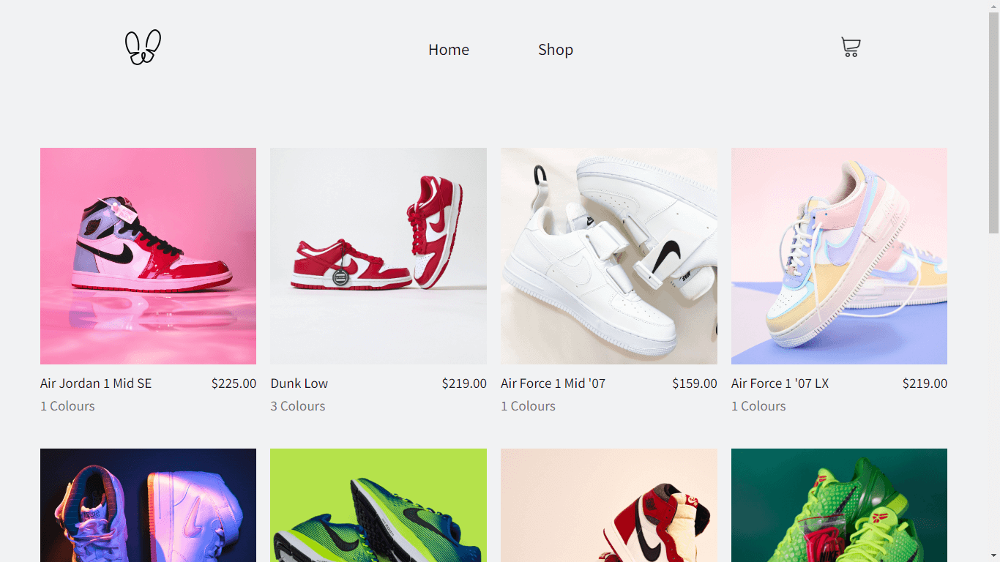
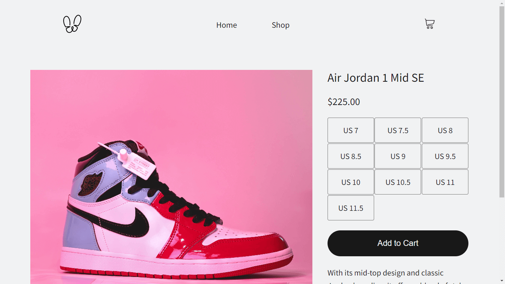
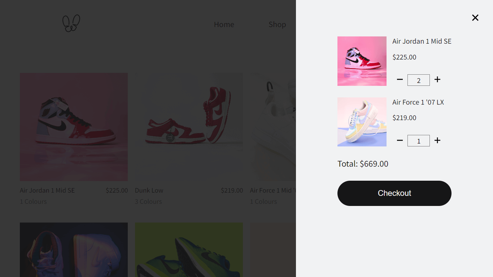

# Shopping Cart

A Shopping Cart application built with React for TheOdinProject. The application allows users to browse through a collection of products, add or remove items from their cart, and proceed to checkout.

## Features

✧ Browse products in the shop 
✧ Add products to the cart 
✧ Remove products from the cart 
✧ Adjust the quantity of products in the cart 
✧ View the total cost of items in the cart 

## Roadmap

- [ ] Implement functionality to allow users to select size for products
- [ ] Organize products into categories for easier browsing and filtering
- [ ] Add search bar to enable users to search for specific products
- [ ] Add persistent storage for cart data
- [ ] Integrate a mock payment gateway to enable users to checkout and pay for their orders

## Learnings

✧ React Router  
✧ React Context and Reducer 
✧ Lazy Loading images 
✧ Intl.NumberFormat 
✧ Custom hooks 

## Preview

### Home

### Shop

### Product

### Cart

## Demo

👉 [Live Demo](https://ruchita1010.github.io/shopping-cart)
